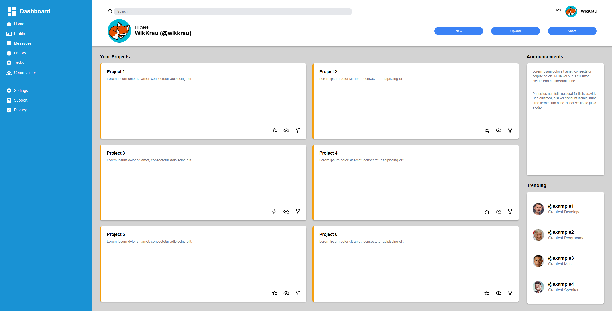

My admin control panel.
Live Preview:

Sidebar Navigation
Dashboard - Main overview page (currently active)
Home - Home page navigation
Profile - User profile management
Messages - Communication/messaging system
History - Activity history and logs
Tasks - Task management system
Communities - Community/group features
Settings - System configuration
Support - Help and support section
Privacy - Privacy settings and controls
Header Functions
Search Bar - Global search functionality across the platform
User Profile Display - Shows current user (Morgan Oakley) with profile picture
Action Buttons:
New - Create new content/projects
Upload - File upload functionality
Share - Share content with others
Greeting Section - Personalized welcome message with larger profile picture
Main Content Area
Projects Section
Project Grid - Displays 6 projects in a 2x3 layout
Project Cards - Each contains:
Project title (Project 1-6)
Lorem ipsum description text
Action icons (star, eye, share) in bottom right
Scrollable - Can handle more than 6 projects with auto-scroll
Announcements Section
Announcement Display - Shows important updates and notices
Site Maintenance - System status notifications
Community Share Day - Event announcements
Updated Privacy Policy - Policy change notifications
Scrollable Content - Handles multiple announcements
Trending Section
User Activity Display - Shows trending users/projects
Profile Integration - User avatars and names
Project Association - Links users to their projects
Activity Tracking - Shows what users are working on
Responsive Design Features
Fixed Sidebar - Stays in place while content scrolls
Sticky Header - Remains visible during scroll
Grid Layout - Responsive project grid
Viewport Scaling - Uses vh/vw units for responsive sizing
Hover Effects - Interactive sidebar items
Shadow Effects - Visual depth with box shadows
Technical Functions
CSS Grid Layout - Modern responsive layout system
Flexbox Alignment - Proper content alignment
Overflow Management - Scroll functionality where needed
Icon Integration - SVG icons throughout interface
Color Theming - Consistent blue color scheme
Typography Hierarchy - Proper font sizing and weights

I dont give a damn, nobody even read this so why do I even bother with Readme. Ts is just for me.